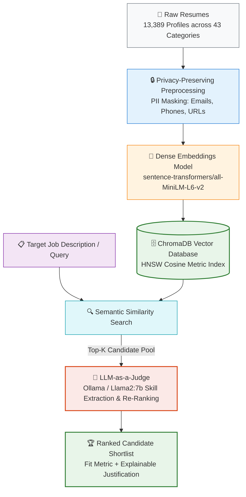

# AI Expert Finder: NLP & Vector Retrieval Matching Engine

[](https://www.python.org/)
[](https://www.langchain.com/)
[](https://www.trychroma.com/)
[](https://sbert.net/)
[](LICENSE)

> A privacy-conscious semantic retrieval and LLM-as-a-Judge re-ranking engine designed to eliminate keyword mismatch and surface overlooked technical talent.

---

## 📌 Executive Summary
Traditional Applicant Tracking Systems (ATS) rely heavily on exact keyword matching, creating a critical "semantic gap" where qualified candidates with non-standard phrasing are filtered out. **AI Expert Finder** solves this using a two-stage hybrid pipeline:
1. **Dense Vector Retrieval**: High-dimensional semantic embeddings (`sentence-transformers/all-MiniLM-L6-v2`) indexed in ChromaDB.
2. **LLM-as-a-Judge Evaluation**: Quantized local LLMs (via Ollama / Llama2) to extract skills and evaluate candidate fit with transparent justifications.

---

## 🏗️ System Architecture



---

## 📊 Benchmark Results

Evaluated across **13,389 resumes** spanning **43 job categories**:

| Category | Query Specificity | MAP@5 | Recall@5 | NDCG@5 | Relevant Found (/5) |
| :--- | :--- | :---: | :---: | :---: | :---: |
| **React Developer** | Moderate | **1.000** | **1.000** | **1.000** | 5/5 |
| **Consultant** | Moderate | **1.000** | **1.000** | **1.000** | 5/5 |
| **Java Developer** | Moderate | **1.000** | **1.000** | **1.000** | 5/5 |
| **Human Resources** | Moderate | **1.000** | **1.000** | **1.000** | 5/5 |
| **System Average** | Across All Queries | **0.736** | **0.720** | **0.785** | - |

**Key Finding**: Moderate query specificity consistently outperformed vague and over-constrained queries, achieving perfect 1.000 MAP@5 across key technical categories.

---

## 📂 Repository Structure

```text
ai-expert-finder/
├── src/
│   ├── preprocessing.py    # PII masking (emails, phones, URLs)
│   ├── vector_store.py     # ChromaDB dense retrieval
│   ├── llm_judge.py        # LLM skill extraction & re-ranking
│   └── evaluation.py       # IR metrics (MAP@k, NDCG@k)
├── data/                   # Schema documentation & sample data
├── benchmarks/             # Evaluation logs & metrics CSV
├── demo.py                 # Interactive CLI pipeline demo
├── requirements.txt        # Python dependencies
└── LICENSE                 # MIT License
```

---

## 🚀 Quickstart Guide

### 1. Clone & Setup Virtual Environment

git clone https://github.com/YOUR_USERNAME/ai-expert-finder.git
cd ai-expert-finder

python3 -m venv venv
source venv/bin/activate  # On Windows: venv\Scripts\activate
pip install -r requirements.txt


### 2. Run the Interactive CLI Demo
Test the end-to-end pipeline (PII redaction, vector matching, and scoring) immediately:

python demo.py --query "React frontend developer with TypeScript and state management"


---

## 📜 License
Distributed under the MIT License. See `LICENSE` for details.


